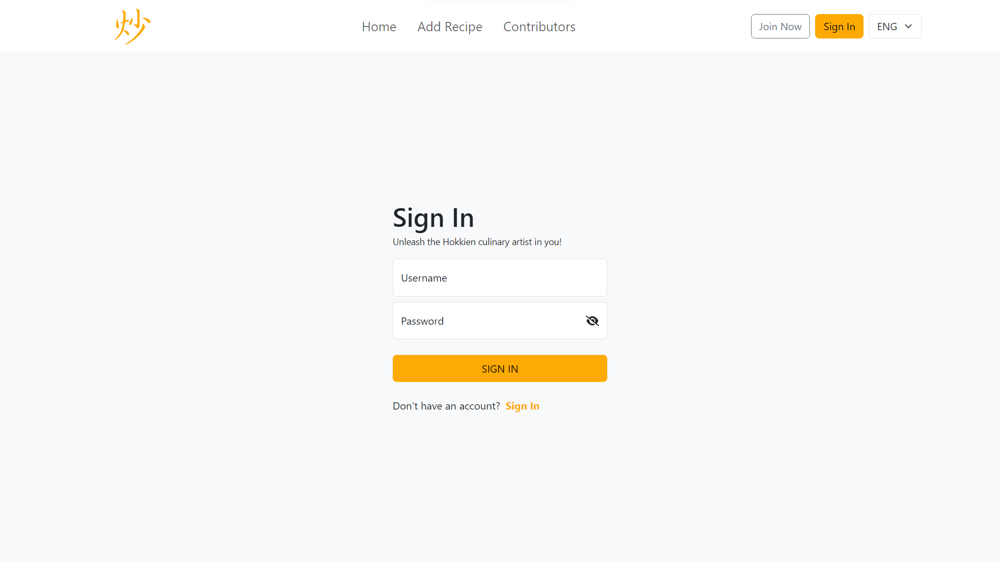
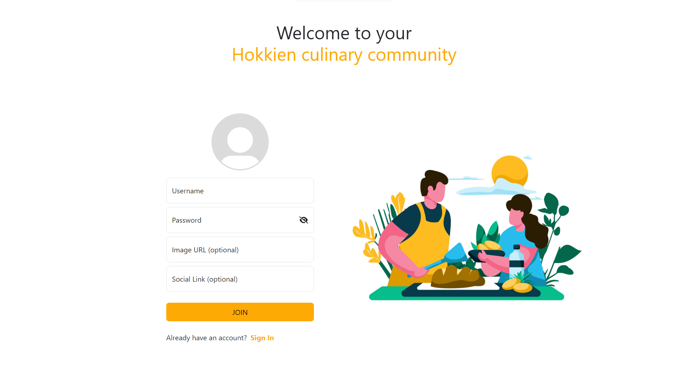
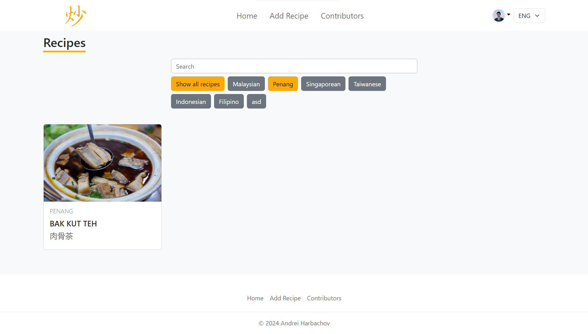
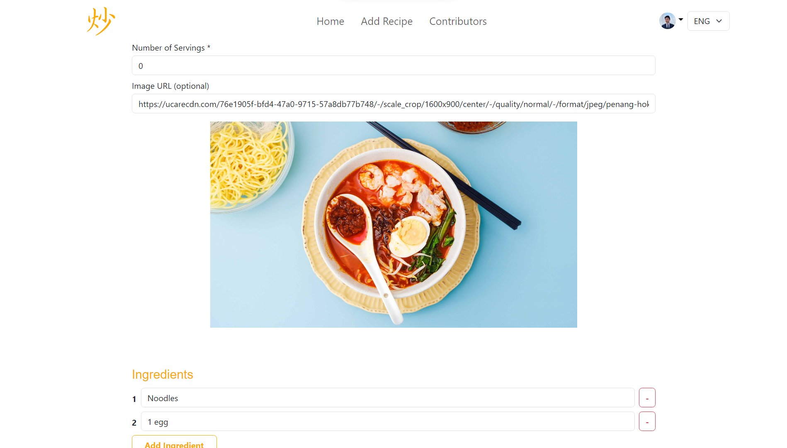
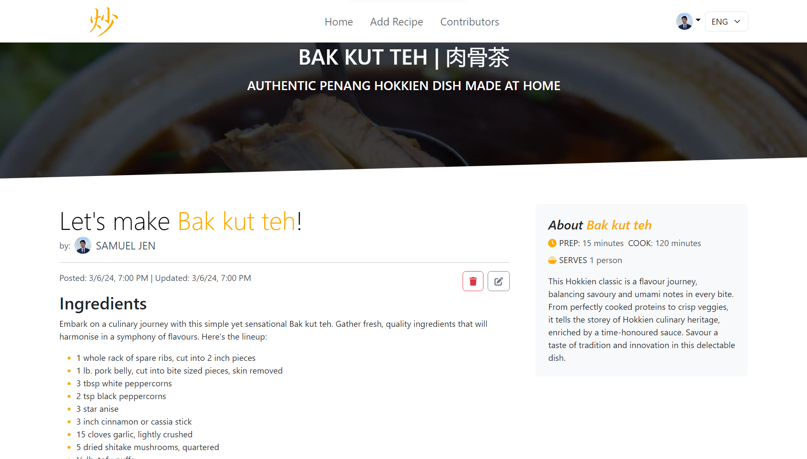
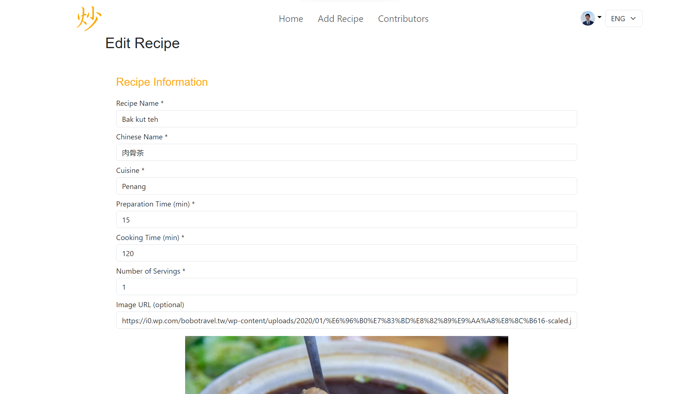
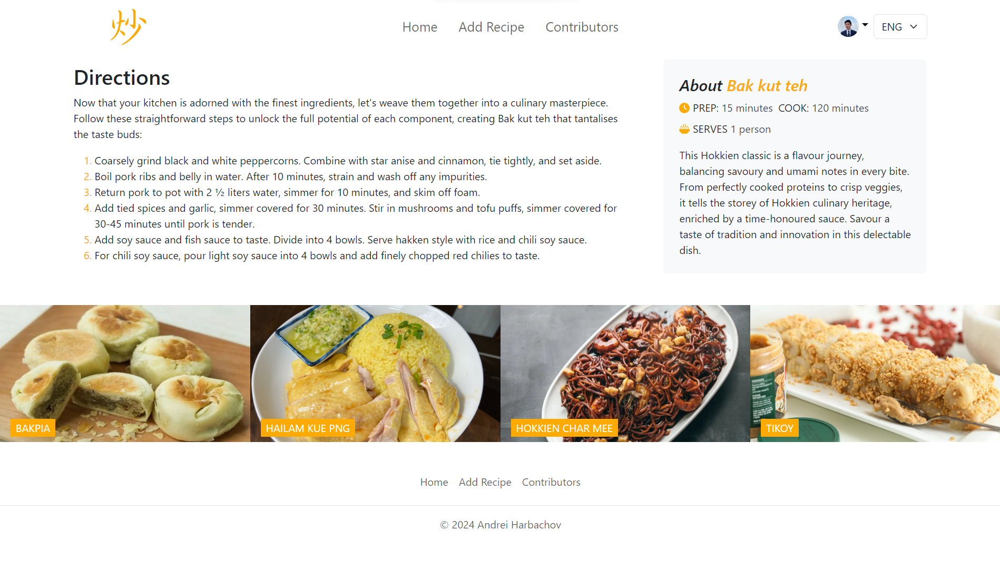
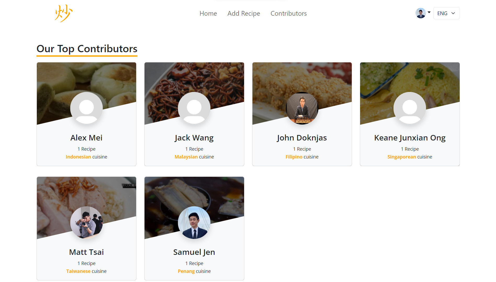
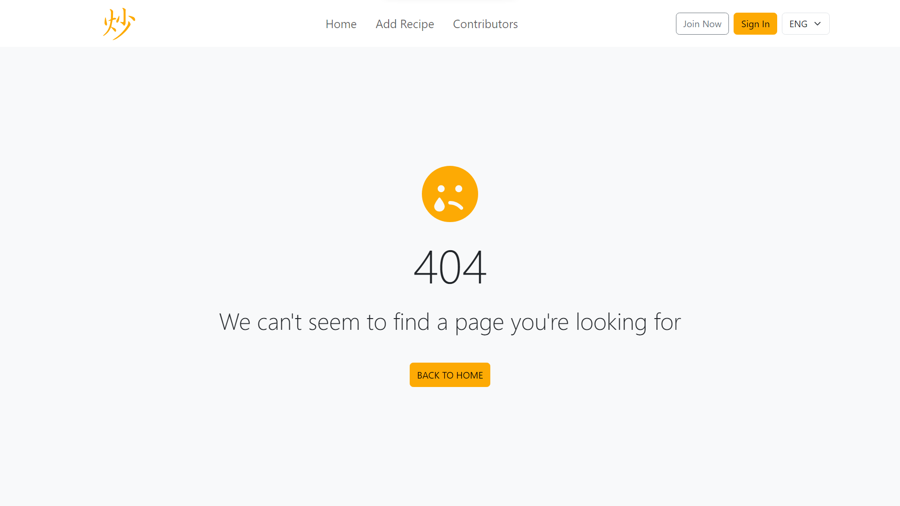

<!-- PROJECT LOGO -->
<div align="center">
  <a href="https://github.com/andreihar/recipe-app">
    
  </a>
  
# ChhármCooks


<!-- PROJECT SHIELDS -->
[![Contributors][contributors-badge]][contributors]
[![Licence][licence-badge]][licence]
[![LinkedIn][linkedin-badge]][linkedin]

**A recipe app for sharing and discovering dishes of Hokkien cuisine**

A comprehensive recipe-sharing platform inspired by Hokkien cuisine. This React-based frontend application is paired with a powerful backend, offering a versatile suite of features including Chinese localisation, User Ranking, Authentication, and more.

[Live Demo][demo]

</div>


---


<!-- TABLE OF CONTENTS -->
<details open>
  <summary>Table of Contents</summary>
  <ol>
    <li>
      <a href="#about-the-project">About The Project</a>
      <ul>
        <li><a href="#built-with">Built With</a></li>
      </ul>
    </li>
	  <li><a href="#install">Install</a></li>
    <li>
      <a href="#features">Features</a>
      <ul>
        <li><a href="#authentication">Authentication</a></li>
        <li><a href="#localisation">Localisation</a></li>
        <li><a href="#filtering-and-searching">Filtering and Searching</a></li>
        <li><a href="#recipe-creation">Recipe Creation</a></li>
        <li><a href="#recipe-showcase">Recipe Showcase</a>
          <ul>
			      <li><a href="#suggested-recipes">Suggested Recipes</a></li>
          </ul>
        </li>
        <li><a href="#user-ranking">User Ranking</a></li>
        <li><a href="#not-found">Not Found</a></li>
      </ul>
    </li>
    <li><a href="#contributors">Contributors</a></li>
    <li><a href="#licence">Licence</a></li>
  </ol>
</details>


<!-- ABOUT THE PROJECT -->
## About The Project

ChhármCooks is the assignment project created for the course in Server-side Development in the Spring semester of 2024. The assignment's theme was to develop a recipe website with CRUD database functionality and an emphasis on providing an effective user experience in the frontend.

The platform aims to provide a dynamic space for users to share, explore, and celebrate Hokkien cuisine through a diverse array of recipes. With a focus on user experience and functionality, the project incorporates features such as user authentication, Chinese localisation, filtering and searching, user ranking, and more.

Guided by a dedication to preserving and promoting Hokkien cuisine, this project has been developed to empower users to share their favorite recipes. Through this platform, users can contribute to the preservation and celebration of this rich culinary tradition for generations to come.

### Built With

* [![React][react-badge]][react]
* [![Vite][vite-badge]][vite]
* [![Bootstrap][bootstrap-badge]][bootstrap]
* [![Express][express-badge]][express]
* [![Postgres][postgres-badge]][postgres]


<!-- INSTALL -->
## Install

Run the app locally:

```bash
$ npm install
$ npm run dev
```

The website can be accessed through the URL `http://localhost:5173/`.


<!-- FEATURES -->
## Features

### Authentication

Users can sign in or sign up for the service using intuitive pages. Authentication ensures that only authenticated users can create, delete, and modify recipes. This process occurs securely on the backend, preventing sensitive information from being accessible to clients.

<p align="center">

</p>

<p align="center">

</p>

### Localisation

Users can switch between English and Chinese languages by selecting the desired option from the language selector drop-down menu in the Navbar.

<p align="center">

</p>

### Filtering and Searching

To provide a personalised browsing experience, recipes can be searched by name or filtered by cuisine. Logged-in users have the option to filter recipes created only by them.

<p align="center">

</p>

### Recipe Creation

Users can create recipes via the "Add Recipe" button, which reveals a user-friendly form. The form allows users to preview images input via URL to ensure accurate image parsing. Users can add and remove ingredients and directions as needed.

<p align="center">

</p>

### Recipe Showcase

Users can view recipes by clicking on recipe cards on the Home Page. To maintain integrity, only logged-in users who authored a recipe have the privilege to delete or edit them. When editing a recipe, users are redirected to the Form page, where all input fields are pre-populated with information from the selected recipe. Upon submission of the form, the existing recipe entry will be promptly modified.

<p align="center">

</p>

<p align="center">

</p>

#### Suggested Recipes

Users are presented with a randomised list of suggested recipes at the bottom of the Recipe Showcase page.

<p align="center">

</p>

### User Ranking

A list of users is displayed based on the number of recipes they've created, sorted alphabetically by name. Additionally, the most common cuisine of the recipes posted by each user is indicated, providing insight into the cuisines they specialise in or excel at.

<p align="center">

</p>

### Not Found

In the event of a non-existent page, users are redirected to a 404 page with intuitive navigation options to return to existing pages.

<p align="center">

</p>


<!-- CONTRIBUTORS -->
## Contributors

- Andrei Harbachov ([GitHub][andrei-github] · [LinkedIn][andrei-linkedin])


<!-- ACKNOWLEDGEMENTS -->
## Acknowledgements

- Jack Wang ([Github][jack-github] · [LinkedIn][jack-linkedin]) - Mandarin localisation
- Samuel Jen ([Github][samuel-github] · [LinkedIn][samuel-linkedin]) - Mandarin localisation


<!-- LICENCE -->
## Licence

Because ChhármCooks is MIT-licensed, any developer can essentially do whatever they want with it as long as they include the original copyright and licence notice in any copies of the source code.


<!-- MARKDOWN LINKS -->
<!-- Badges and their links -->
[contributors-badge]: https://img.shields.io/badge/Contributors-1-44cc11?style=for-the-badge
[contributors]: #contributors
[licence-badge]: https://img.shields.io/github/license/andreihar/recipe-app.svg?color=000000&style=for-the-badge
[licence]: LICENSE
[linkedin-badge]: https://img.shields.io/badge/LinkedIn-0077B5?style=for-the-badge&logo=linkedin&logoColor=white
[linkedin]: https://www.linkedin.com/in/andrei-harbachov/
[react-badge]: https://img.shields.io/badge/React-087EA4?style=for-the-badge&logo=react&logoColor=ffffff
[react]: https://react.dev/
[vite-badge]: https://img.shields.io/badge/Vite-646CFF?style=for-the-badge&logo=vite&logoColor=ffffff
[vite]: https://vitejs.dev
[bootstrap-badge]: https://img.shields.io/badge/Bootstrap-7B12F8?style=for-the-badge&logo=bootstrap&logoColor=ffffff
[bootstrap]: https://getbootstrap.com/
[express-badge]: https://img.shields.io/badge/Express-259DFF?style=for-the-badge&logo=express&logoColor=ffffff
[express]: https://expressjs.com/
[postgres-badge]: https://img.shields.io/badge/PostgreSQL-336791?style=for-the-badge&logo=postgresql&logoColor=ffffff
[postgres]: https://www.postgresql.org/

<!-- Technical links -->
[demo]: https://github.com/andreihar/recipe-app

<!-- Socials -->
[andrei-linkedin]: https://www.linkedin.com/in/andrei-harbachov/
[andrei-github]: https://github.com/andreihar
[jack-linkedin]: https://www.linkedin.com/in/jack-wang-295815170/
[jack-github]: https://github.com/jackwang316
[samuel-linkedin]: https://www.linkedin.com/in/samuel-jen/
[samuel-github]: https://github.com/SSSam
