<!-- PROJECT LOGO -->
<div align="center">
  <a href="https://github.com/andreihar/recipe-app">
    
  </a>
  
# ChhármCooks


<!-- PROJECT SHIELDS -->
[![Contributors][contributors-badge]][contributors]
[![Licence][licence-badge]][licence]
[![LinkedIn][linkedin-badge]][linkedin]

**A recipe app for sharing and discovering dishes of Hokkien cuisine**

A comprehensive recipe-sharing platform inspired by Hokkien cuisine. This React-based frontend application is paired with a powerful backend, offering a versatile suite of features including Blog Creator, User Profiles, Notifications, and more.

[Live Demo][demo]


https://github.com/andreihar/recipe-app/assets/95883512/8c8a6a1e-2009-4ee1-9eed-683e406eb0d8


</div>


---


<!-- TABLE OF CONTENTS -->
<details open>
  <summary>Table of Contents</summary>
  <ol>
    <li>
      <a href="#about-the-project">About The Project</a>
      <ul>
        <li><a href="#built-with">Built With</a></li>
      </ul>
    </li>
    <li><a href="#install">Install</a></li>
    <li>
      <a href="#features">Features</a>
      <ul>
        <li><a href="#authentication">Authentication</a></li>
        <li><a href="#filtering-and-searching">Filtering and Searching</a></li>
        <li><a href="#recipe-creation">Recipe Creation</a>
          <ul>
            <li><a href="#blog-creation">Blog Creation</a></li>
          </ul>
        </li>
        <li><a href="#recipe-showcase">Recipe Showcase</a>
          <ul>
            <li><a href="#recipe-edit">Recipe Edit</a></li>
            <li><a href="#recipe-card">Recipe Card</a></li>
          </ul>
        </li>
        <li><a href="#rating-and-commenting">Rating and Commenting</a></li>
        <li><a href="#user-profile">User Profile</a></li>
        <li><a href="#notifications">Notifications</a></li>
        <li><a href="#settings">Settings</a></li>
        <li><a href="#user-ranking">User Ranking</a></li>
        <li><a href="#localisation">Localisation</a></li>
      </ul>
    </li>
    <li><a href="#lighthouse-report">Lighthouse Report</a></li>
    <li><a href="#contributors">Contributors</a></li>
    <li><a href="#licence">Licence</a></li>
  </ol>
</details>


<!-- ABOUT THE PROJECT -->
## About The Project

ChhármCooks is the assignment project created for the course in Server-side Development in the Spring semester of 2024. The assignment's theme was to develop a recipe website with CRUD database functionality and an emphasis on providing an effective user experience in the frontend.

The platform aims to provide a dynamic space for users to share, explore, and celebrate Hokkien cuisine through a diverse array of recipes. With a focus on user experience and functionality, the project incorporates features such as Commenting, seamless Recipe Creation, Filtering and Searching, Notifications, and more.

Guided by a dedication to preserving and promoting Hokkien cuisine, this project has been developed to empower users to share their favourite recipes. Through this platform, users can contribute to the preservation and celebration of this rich culinary tradition for generations to come.

### Built With

* [![React][react-badge]][react]
* [![Auth0][auth0-badge]][auth0]
* [![Bootstrap][bootstrap-badge]][bootstrap]
* [![Express][express-badge]][express]
* [![Postgres][postgres-badge]][postgres]


<!-- INSTALL -->
## Install

To run the app locally, you need to set up both the frontend and backend.

**Backend**

```bash
$ cd server
$ npm install
$ cp .env.example .env
```

Fill in the required values for Auth0 and PostgreSQL in the .env file.

```bash
$ npm run dev
```

**Frontend**

```bash
$ cd client
$ npm install
$ cp .env.example .env
```

Fill in the required values for Auth0, as well as the backend and frontend URLs in the .env file. By default, the backend URL should be set to `http://localhost:4000` and the frontend URL to `http://localhost:5173`.

```bash
$ npm run generate-sitemap
$ npm run dev
```

The website can be accessed through the URL `http://localhost:5173/`.


<!-- FEATURES -->
## Features

### Authentication

Users can sign up or sign in to the platform using Auth0. Authentication ensures that only authenticated users can create, delete, and modify recipes. Upon registration, new users are guided through a multi-step signup process, allowing them to provide additional information beyond the basic details collected by Auth0. This extra layer of customisation enhances user profiles and enriches the overall user experience on the platform.

<p align="center">

</p>

### Filtering and Searching

To provide a personalised browsing experience, the platform offers a robust filtering and search feature. Users can search for recipes by name or filter them by both national and regional cuisines, reflecting the diverse culinary traditions within Hokkien cuisine. This allows users to explore recipes that align with their specific interests, whether they're looking for broader categories or more localised variations.

<p align="center">
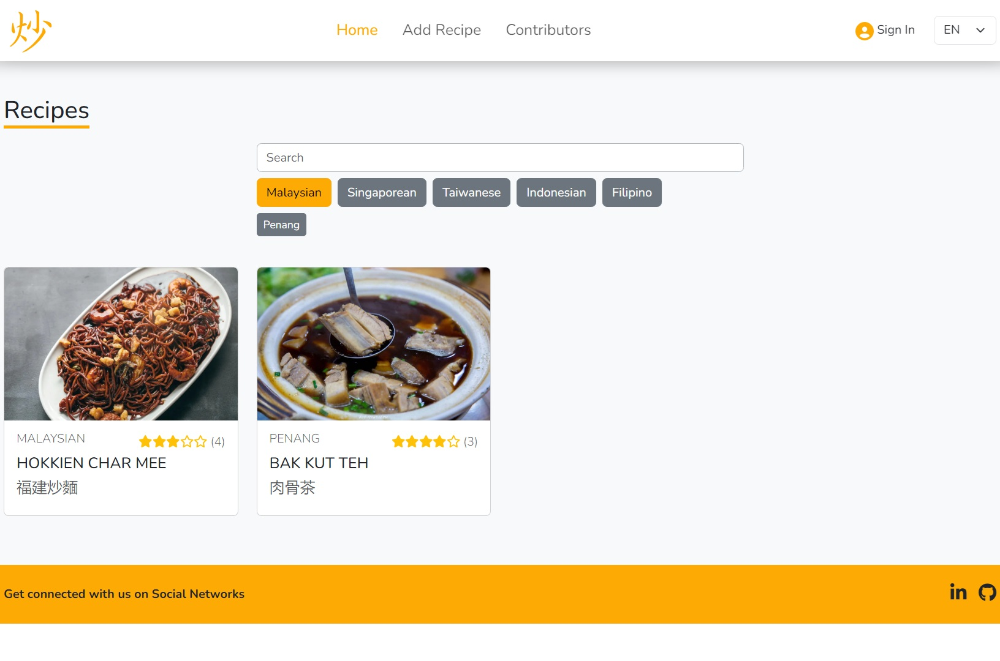
</p>

### Recipe Creation

Users can create recipes via the "Add Recipe" button, which reveals a user-friendly form. The form includes a real-time preview of the banner image provided via URL, ensuring accurate display. The cuisine selection process is intuitive, featuring a hierarchical structure where regional cuisines are listed under their corresponding national categories, with the option to search by name for added convenience. Users can add or remove ingredient and direction fields as needed, making the recipe creation process flexible and straightforward.

<p align="center">
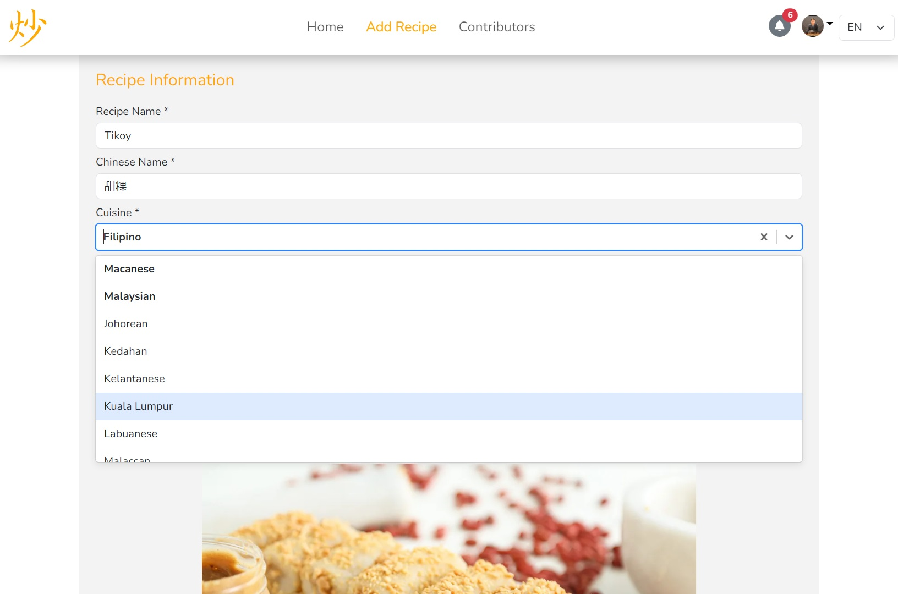
</p>

#### Blog Creation

Users can enhance their recipes with rich, blog-style descriptions. Using the integrated text editor, users can format their content with headings, titles, bold and italic text, and easily embed links and images. This feature empowers users to share not only the recipe itself but also personal stories, cooking tips, and cultural insights, making each recipe more engaging and informative.

<p align="center">
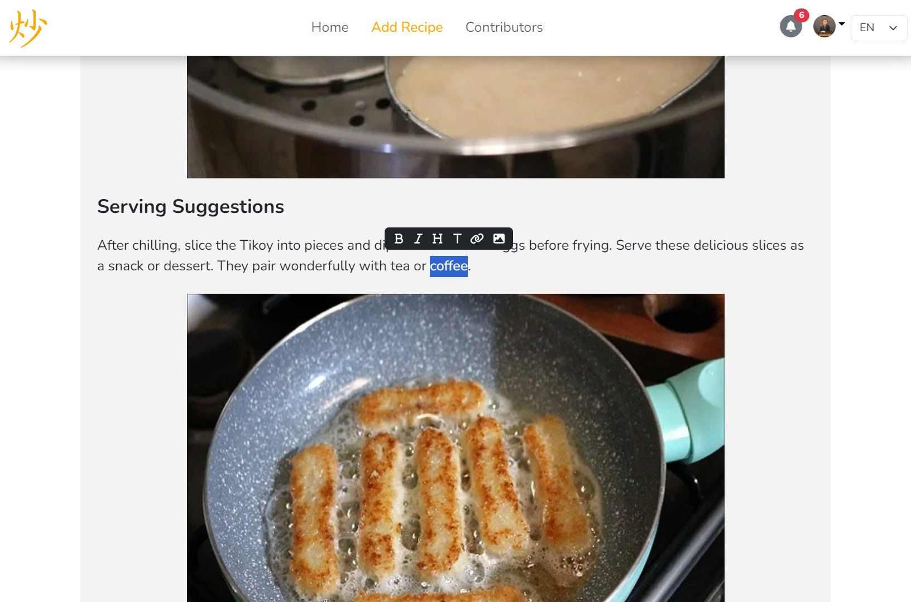
</p>

### Recipe Showcase

Users can view recipes by clicking on recipe cards on the Home Page. To ensure content integrity, only logged-in users who authored a recipe have the privilege to delete them.

Users can view recipes by clicking on recipe cards on the Home Page. Each recipe offers a wealth of content, including essential details like its popularity, creation, and modification dates, along with a blog-style narrative featuring cooking tips, serving suggestions, and cultural insights. To ensure content integrity, only logged-in users who authored a recipe have the privilege to delete them.

<p align="center">
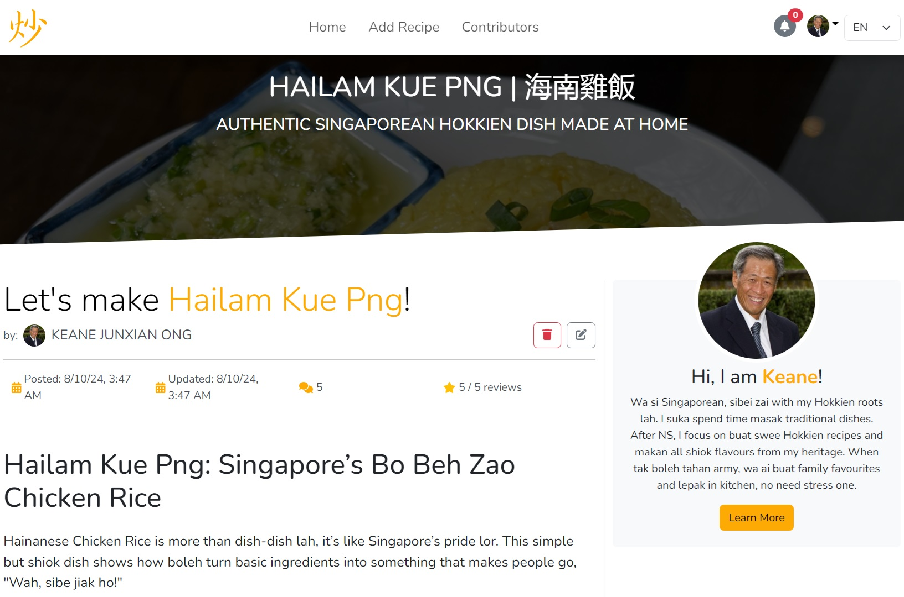
</p>

#### Recipe Edit

Logged-in users who authored a recipe can edit it by clicking the edit option. This redirects them to the Form page, where all input fields are pre-populated with the existing recipe information. After making changes, users can submit the form to update the recipe entry instantly.

<p align="center">
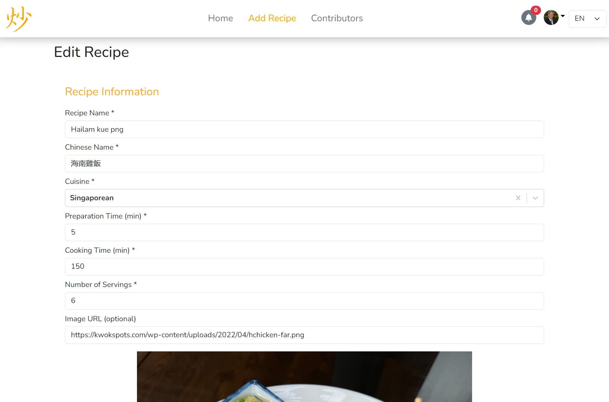
</p>

#### Recipe Card

The Recipe Card provides a streamlined and easy-to-follow format that includes all essential details needed to recreate the dish. With a simple layout, users can effortlessly adjust the recipe to match the desired number of servings. The interactive ingredients list allows users to mark off items as they go, ensuring an organised and efficient cooking experience.

<p align="center">
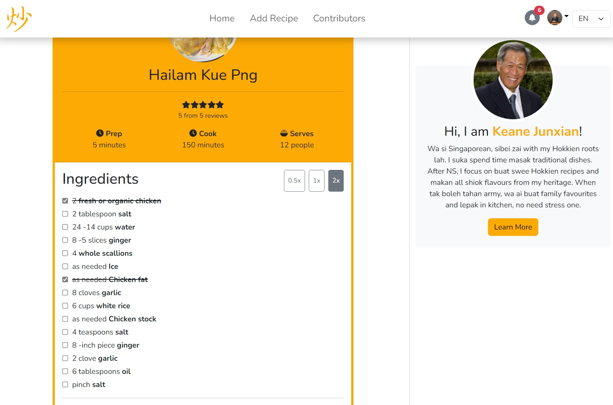
</p>

### Rating and Commeting

Users are allowed to share their thoughts and feedback on recipes by rating them from 1 to 5 stars and leaving comments. After trying a recipe, users can rate it and provide detailed feedback, which will be visible to others. Each recipe's average rating is displayed on the recipe cards, offering a quick overview of its popularity.

<p align="center">
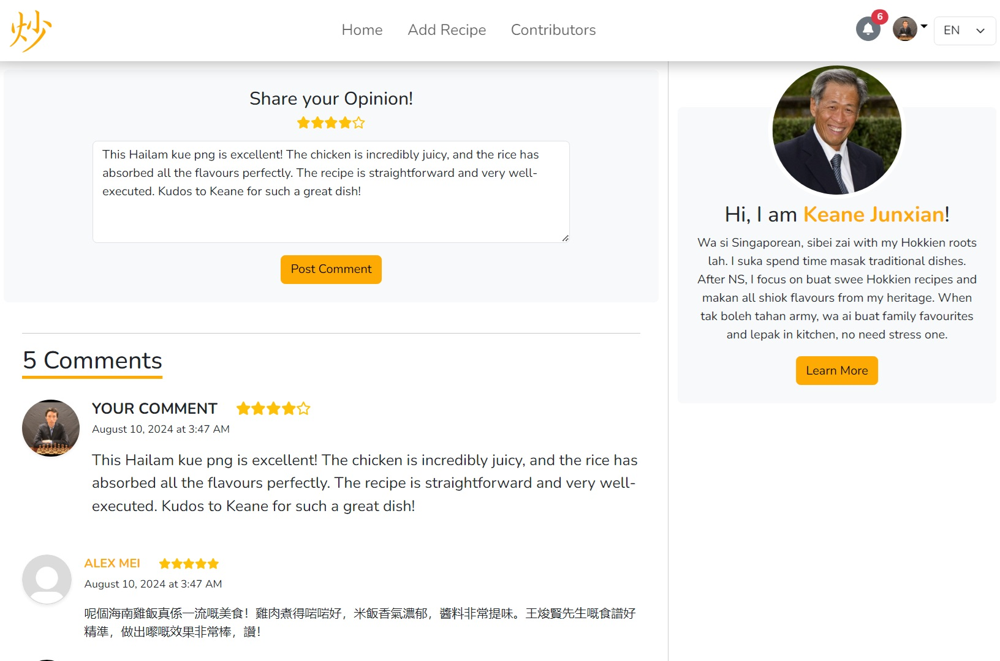
</p>

### User Profile

The User Profile feature allows users to follow or unfollow others and view detailed information on their profiles. Each profile displays the user's name, occupation, location, and their social media link. Users can also explore the individual's biography, a list of their recipes, and their connections, including those they follow and who follows them.

<p align="center">
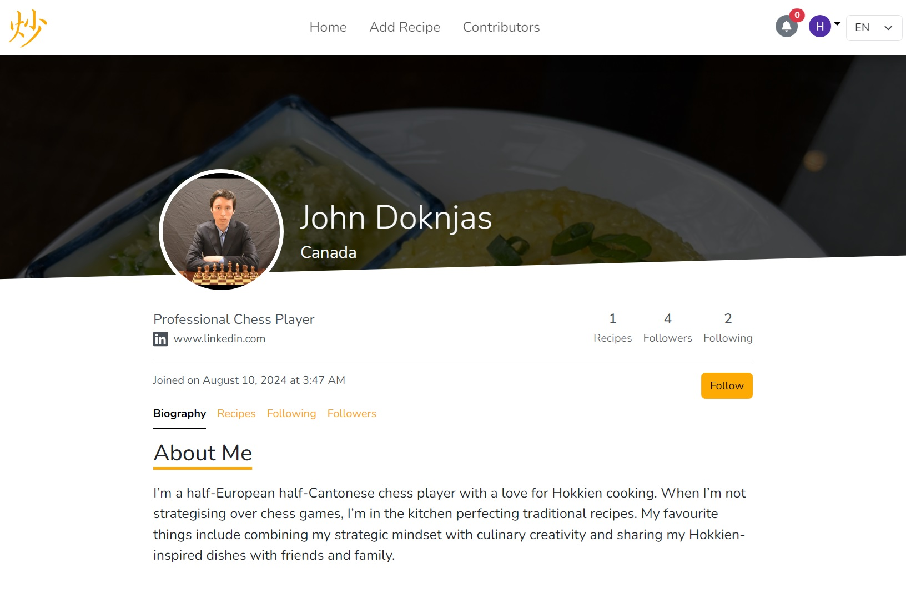
</p>

### Notifications

The Notifications feature keeps users updated on activities related to their connections and interests. Whenever someone they follow adds a new recipe or comments on a recipe, users receive a notification alerting them to the new content. This feature ensures that users stay informed about updates and interactions within their network, helping them engage with the latest recipes and discussions.

<p align="center">
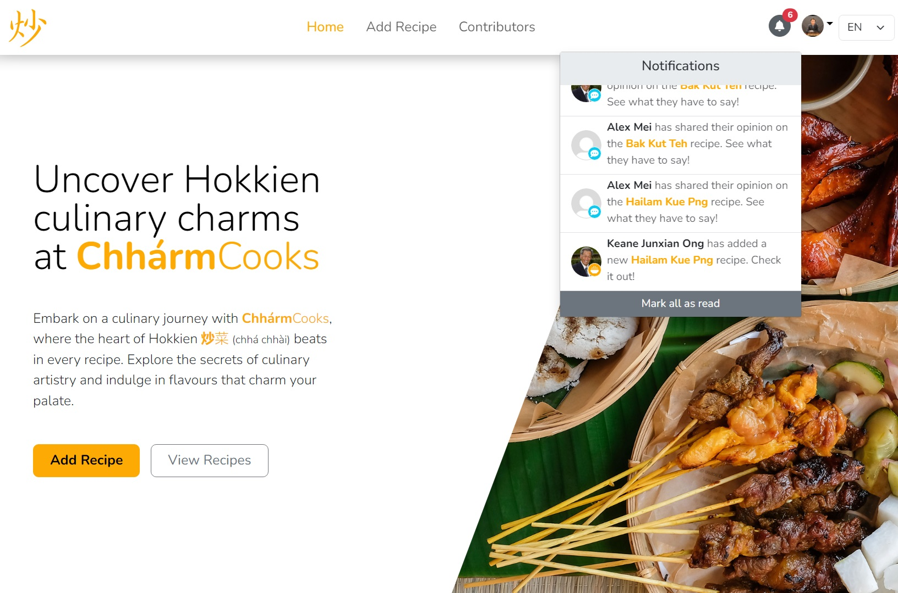
</p>

### Settings

The Settings provide users with a centralised area to update and manage their essential profile information. Users can modify their profile picture, social media link, and general details including their first name, last name, occupation, and country. Additionally, users can update their biography to reflect personal interests and achievements. This feature ensures that users can keep their profiles current and accurately represent themselves within the platform.

<p align="center">
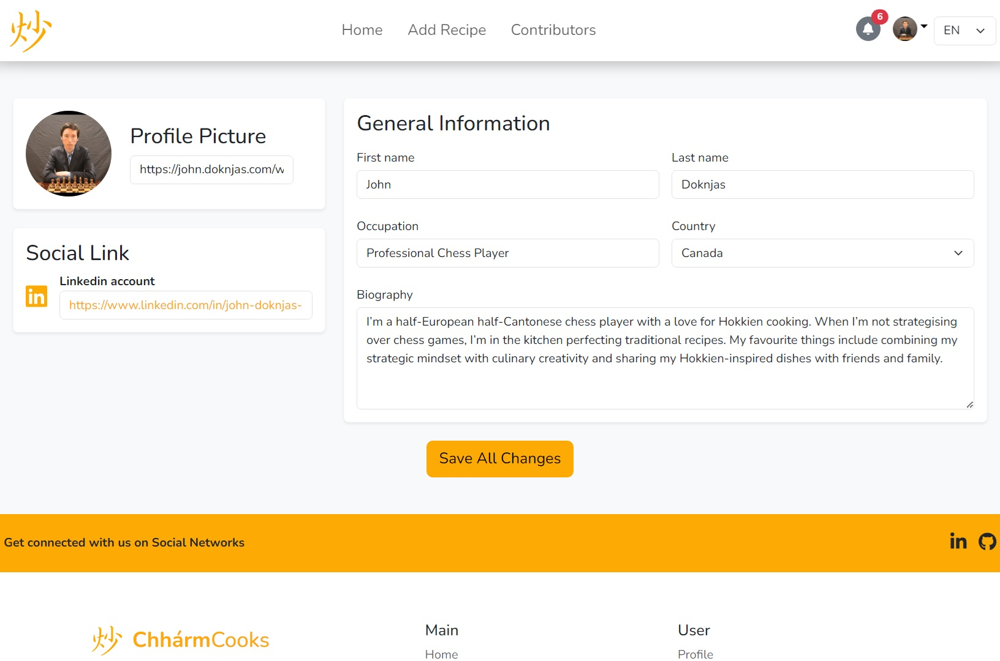
</p>

### User Ranking

A list of users is displayed based on the number of recipes they've created, sorted alphabetically by name. Additionally, the most common cuisine of the recipes posted by each user is indicated, providing insight into the cuisines they specialise in.

<p align="center">
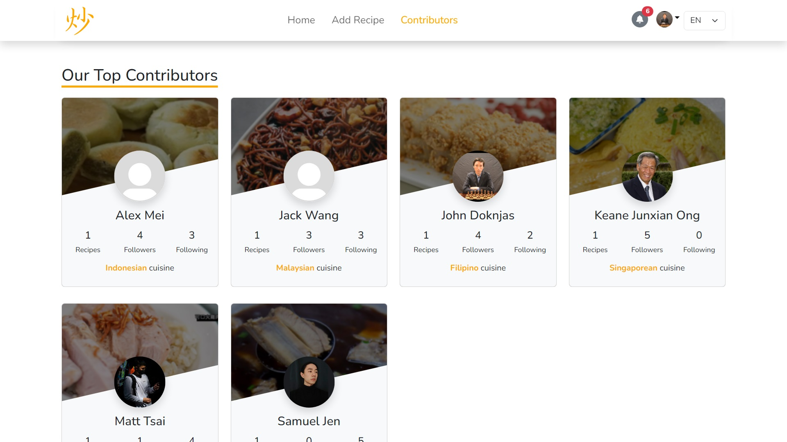
</p>

### Localisation

Users can switch between English, Chinese, and Malay languages by selecting the desired option from the language selector drop-down menu in the Navbar.

<p align="center">
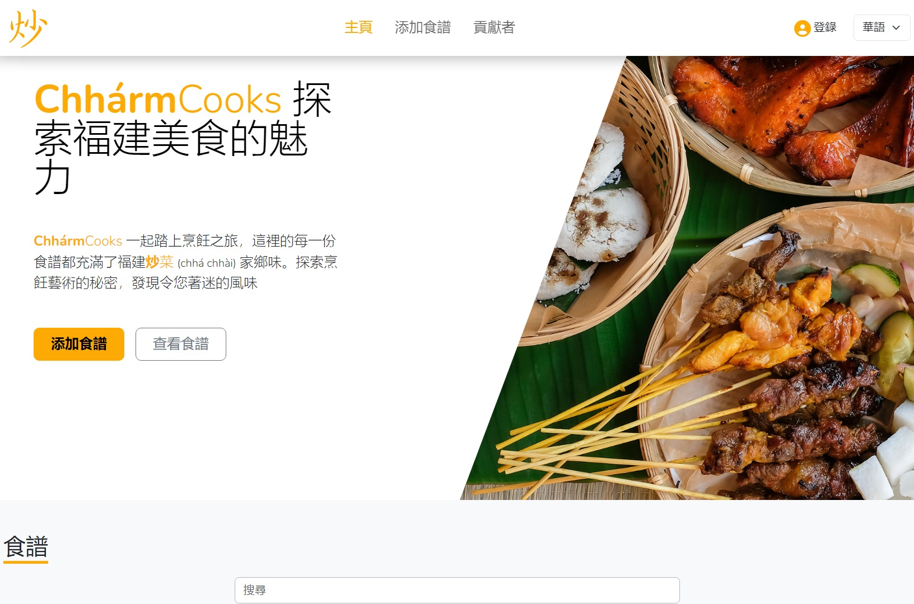
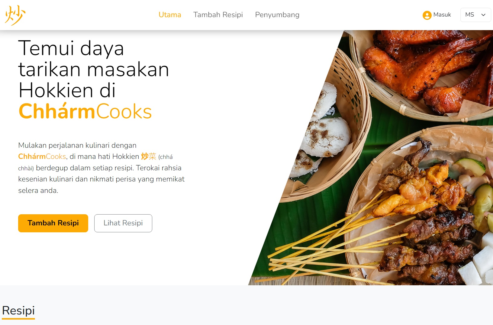
</p>


<!-- LIGHTHOUSE -->
## Lighthouse Report

<p align="center">
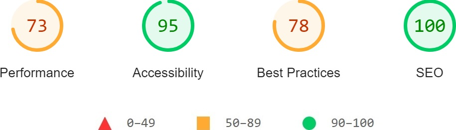
</p>


<!-- CONTRIBUTORS -->
## Contributors

- Andrei Harbachov ([GitHub][andrei-github] · [LinkedIn][andrei-linkedin])


<!-- ACKNOWLEDGEMENTS -->
## Acknowledgements

- Samuel Jen ([Github][samuel-github] · [LinkedIn][samuel-linkedin]) - Mandarin localisation


<!-- LICENCE -->
## Licence

Because ChhármCooks is MIT-licensed, any developer can essentially do whatever they want with it as long as they include the original copyright and licence notice in any copies of the source code.


<!-- MARKDOWN LINKS -->
<!-- Badges and their links -->
[contributors-badge]: https://img.shields.io/badge/Contributors-1-44cc11?style=for-the-badge
[contributors]: #contributors
[licence-badge]: https://img.shields.io/github/license/andreihar/recipe-app.svg?color=000000&style=for-the-badge
[licence]: LICENSE
[linkedin-badge]: https://img.shields.io/badge/LinkedIn-0077B5?style=for-the-badge&logo=linkedin&logoColor=white
[linkedin]: https://www.linkedin.com/in/andrei-harbachov/
[react-badge]: https://img.shields.io/badge/React-087EA4?style=for-the-badge&logo=react&logoColor=ffffff
[react]: https://react.dev/
[auth0-badge]: https://img.shields.io/badge/Auth0-EB5424?style=for-the-badge&logo=auth0&logoColor=ffffff
[auth0]: https://auth0.com/
[bootstrap-badge]: https://img.shields.io/badge/Bootstrap-7B12F8?style=for-the-badge&logo=bootstrap&logoColor=ffffff
[bootstrap]: https://getbootstrap.com/
[express-badge]: https://img.shields.io/badge/Express-259DFF?style=for-the-badge&logo=express&logoColor=ffffff
[express]: https://expressjs.com/
[postgres-badge]: https://img.shields.io/badge/PostgreSQL-336791?style=for-the-badge&logo=postgresql&logoColor=ffffff
[postgres]: https://www.postgresql.org/

<!-- Technical links -->
[demo]: https://chharmcooks.andreihar.com/

<!-- Socials -->
[andrei-linkedin]: https://www.linkedin.com/in/andrei-harbachov/
[andrei-github]: https://github.com/andreihar
[samuel-linkedin]: https://www.linkedin.com/in/samuel-jen/
[samuel-github]: https://github.com/SSSam
