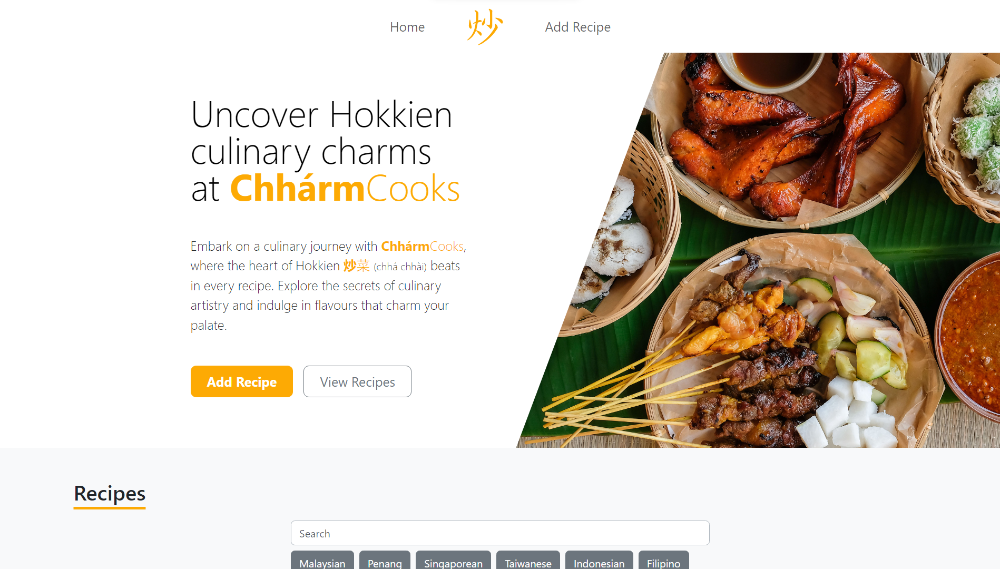
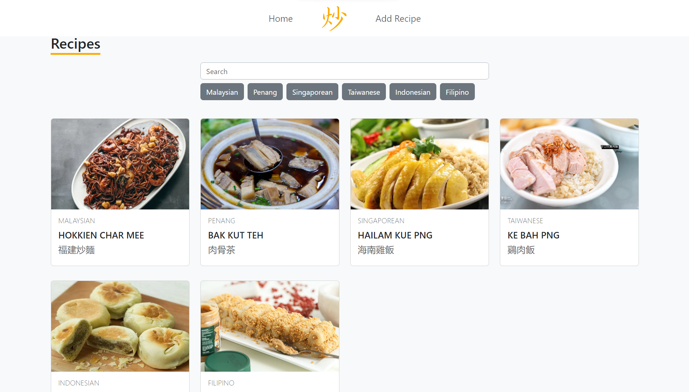

<!-- PROJECT LOGO -->
<div align="center">
  <a href="https://github.com/andreihar/recipe-app">
    
  </a>
  
# ChhármCooks


<!-- PROJECT SHIELDS -->
[![Contributors][contributors-badge]][contributors]
[![Licence][licence-badge]][licence]
[![LinkedIn][linkedin-badge]][linkedin]

**A recipe app for sharing and discovering dishes of Hokkien cuisine**

A recipe-sharing platform inspired by Hokkien cuisine. This React-based app offers a versatile suite of features, including recipe browsing, creation, showcasing, and more.

[Live Demo][demo]

</div>


---


<!-- TABLE OF CONTENTS -->
<details open>
  <summary>Table of Contents</summary>
  <ol>
    <li>
      <a href="#about-the-project">About The Project</a>
      <ul>
        <li><a href="#built-with">Built With</a></li>
      </ul>
    </li>
	  <li><a href="#install">Install</a></li>
    <li>
      <a href="#features">Features</a>
      <ul>
        <li><a href="#home-page">Home Page</a>
          <ul>
			      <li><a href="#list-display">List Display</a></li>
          </ul>
        </li>
        <li><a href="#recipe-creation">Recipe Creation</a></li>
        <li><a href="#recipe-showcase">Recipe Showcase</a></li>
      </ul>
    </li>
    <li><a href="#contributors">Contributors</a></li>
    <li><a href="#licence">Licence</a></li>
  </ol>
</details>


<!-- ABOUT THE PROJECT -->
## About The Project

ChhármCooks is the assignment project created for the course in Server-side Development in the Spring semester of 2024.

### Built With

* [![React][react-badge]][react]
* [![Vite][vite-badge]][vite]
* [![Bootstrap][bootstrap-badge]][bootstrap]


<!-- INSTALL -->
## Install

Run the app locally:

```bash
$ npm install
$ npm run dev
```

The website can be accessed through the URL `http://localhost:5173/`.


<!-- FEATURES -->
## Features

### Home Page

The Home Page serves as the central hub for users to navigate through different aspects of the application. Header with links to Home Page and Recipe Creation page is available on all pages.

<p align="center">

</p>

#### List Display

The website features an array of recipes, dynamically sorted by their creation dates. Users can search recipes by their name using the search bar. Additionally, recipes can be filtered based on their cuisines by pressing respective buttons.

<p align="center">

</p>

### Recipe Creation

Users can generate recipes through a "Add Recipe" button, revealing a user-friendly recipe form. The form allows the user to preview the image that they input through url, ensuring that there is no error in image parsing.

<p align="center">

</p>

### Recipe Showcase

Users can view recipes by clicking on recipe cards on Home Page, or suggested other Recipes at the bottom of the Recipe Showcase page.

<p align="center">

</p>


<!-- CONTRIBUTORS -->
## Contributors

- Andrei Harbachov ([GitHub][andrei-github] · [LinkedIn][andrei-linkedin])


<!-- LICENCE -->
## Licence

Because ChhármCooks is MIT-licensed, any developer can essentially do whatever they want with it as long as they include the original copyright and licence notice in any copies of the source code.


<!-- MARKDOWN LINKS -->
<!-- Badges and their links -->
[contributors-badge]: https://img.shields.io/badge/Contributors-1-44cc11?style=for-the-badge
[contributors]: #contributors
[licence-badge]: https://img.shields.io/github/license/andreihar/recipe-app.svg?color=000000&style=for-the-badge
[licence]: LICENSE
[linkedin-badge]: https://img.shields.io/badge/LinkedIn-0077B5?style=for-the-badge&logo=linkedin&logoColor=white
[linkedin]: https://www.linkedin.com/in/andrei-harbachov/
[react-badge]: https://img.shields.io/badge/React-087EA4?style=for-the-badge&logo=react&logoColor=ffffff
[react]: https://react.dev/
[bootstrap-badge]: https://img.shields.io/badge/Bootstrap-7B12F8?style=for-the-badge&logo=bootstrap&logoColor=ffffff
[bootstrap]: https://getbootstrap.com/
[vite-badge]: https://img.shields.io/badge/Vite-646CFF?style=for-the-badge&logo=vite&logoColor=ffffff
[vite]: https://vitejs.dev

<!-- Technical links -->
[demo]: https://github.com/andreihar/recipe-app

<!-- Socials -->
[andrei-linkedin]: https://www.linkedin.com/in/andrei-harbachov/
[andrei-github]: https://github.com/andreihar
